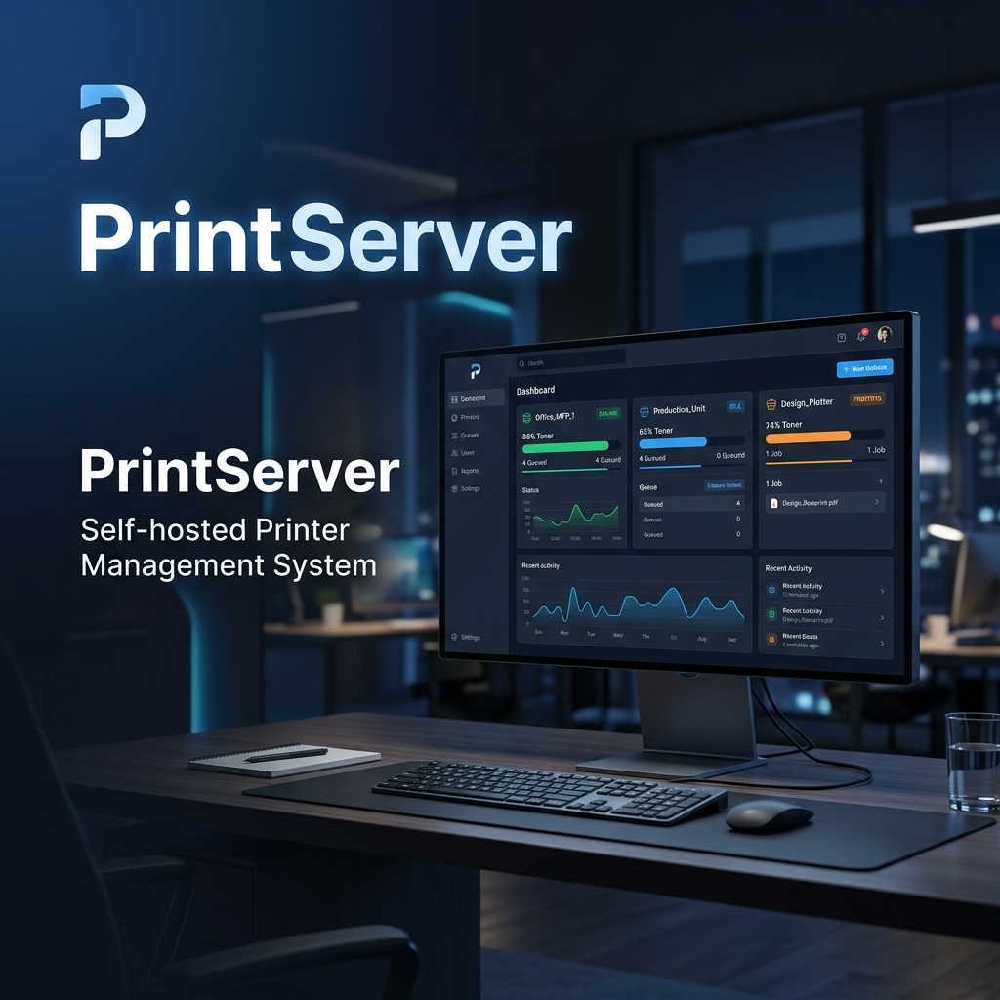
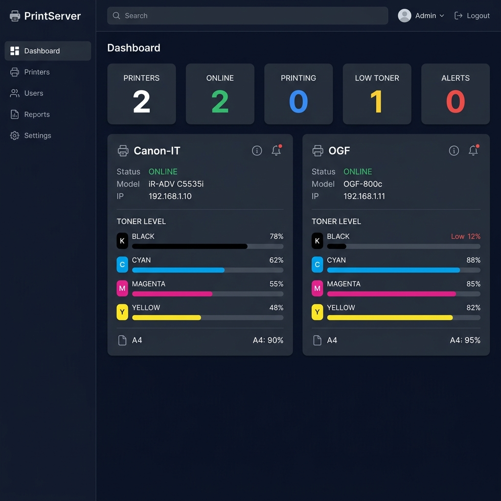

# PrintServer



A powerful, self-hosted office printer & scanner management dashboard with SNMP-based toner/status monitoring, CUPS print queue control, remote SANE scanning, Telegram alerts, print history PDF exports, and Mobile PWA support — all running from a single Node.js process.

---

## Features

### 🖨️ Printer Monitoring
- **SNMP Polling**: Real-time polling for networked printers (Canon, HP, Epson, Brother, Ricoh, Xerox, etc.).
- **Toner & Supply Tracking**: Detailed percentage levels per cartridge with customizable low-toner alerts.
- **Paper & Hardware Status**: Paper tray level detection, paper empty alerts, jam detection, cover open, and service warnings.
- **Reliable Debounce**: Online/offline detection with consecutive-failure debounce to eliminate false alarms from temporary SNMP timeouts.
- **Page Counter & Uptime**: Print volume history tracking per printer and server uptime stats.

### 📋 Print Management (CUPS Integration)
- **Queue Control**: View all active CUPS print queues, pause/resume queues, and set the default printer.
- **Dashboard File Printing**: Direct file printing from web UI (supports PDF, DOCX, XLSX, TXT, and image files).
- **Job Control & Cancellation**: Cancel active/pending print jobs directly from the dashboard.
- **Print History & PDF Export**: View complete history, filter/group by user or printer, multi-select deletion, and 1-click **Export to PDF** with automated 30-day report reminder.

### 📄 Scanner & Samba Support (SANE + SMB)
- **Remote Web Scanning**: Trigger scans from connected SANE scanners directly from the browser UI.
- **Scan File Management**: View, preview, and download scanned documents.
- **Scan-to-Folder (SMB)**: Built-in Samba config generator for `/etc/samba/smb.conf` so Canon/HP network printers can scan directly to `\\SERVER_IP\scans`.

### 🔍 Auto Printer Discovery
- **Subnet SNMP Scanner**: Scan local IP subnets to auto-detect network printers.
- **1-Click Auto-Provisioning**: Automatically creates CUPS print queue (`ipp://<ip>/ipp/print`) and SANE scanner entry (`airscan.conf`) in one click.
- **IPP / CUPS Discovery**: Alternative IPP mDNS discovery for local subnet printers.

### 📱 Mobile PWA & QR Code Access
- **Installable PWA**: Mobile-friendly web app (`/mobile`) with web manifest and service worker.
- **QR Token Access**: Administrator generates a per-user QR code/token for quick mobile login, and can revoke it at any time.
- **Mobile Printing**: Print uploaded files or shared documents directly from the phone.

### 📂 Shared Documents & Groups
- **Shared Documents**: Admin uploads documents to a shared library (`SHARED_DOCS_DIR`) that mobile users can print.
- **Groups**: Organize users and printers into groups (create, edit, delete) for access management.

### 🔔 Telegram Alerts
- **Real-Time Notifications**: Instant alert messages for low toner, empty paper, paper jams, offline state, and back-online recovery.
- **Fine-Grained Toggles**: Enable or disable specific alert types individually.
- **Alert Cooldown & Persistence**: Cooldown timer prevents duplicate spam; state is saved to disk so server restarts don't re-trigger existing alerts.
- **Test Message Button**: Send a test alert to verify bot token and Chat ID.

### 🔐 Security & Access Control
- **Role-Based Auth**: `admin` (full management access) and `user` (read-only monitoring & printing).
- **User Management**: Add new users, manage roles, change passwords, and track user sessions.

---



---

## 🛠️ System Requirements

- **OS**: Linux (Debian / Ubuntu / Raspberry Pi OS recommended)
- **Node.js**: 18.0 or higher
- **Network**: SNMP access (UDP port 161) to network printers
- **Dependencies**: CUPS (`cupsd`), SANE (`sane-utils`, `sane-airscan`), Samba (`smbd` optional for Scan-to-Folder), LibreOffice (optional for DOCX/XLSX printing)

---

## 🚀 Installation Guide

### Option 1: Direct Host Installation (Recommended for CUPS/SANE)

#### 1. Install System Dependencies (Debian/Ubuntu)

```bash
sudo apt update
sudo apt install -y cups cups-client sane-utils sane-airscan samba printer-driver-all libreoffice-writer-nogui libreoffice-calc-nogui
sudo usermod -aG lpadmin $USER

# Grant permissions for SANE scanner auto-provisioning
sudo touch /etc/sane.d/airscan.conf
sudo chown root:lpadmin /etc/sane.d/airscan.conf 2>/dev/null || true
sudo chmod 664 /etc/sane.d/airscan.conf 2>/dev/null || true
```

#### 2. Clone Repository & Install Node Modules

```bash
git clone https://github.com/ramadhan24021996/PrintServer.git
cd PrintServer
npm install
cp printers.example.json printers.json
cp settings.example.json settings.json
```

#### 3. Start Server

```bash
# Development / Testing
npm start

# Production with PM2
sudo npm install -g pm2
pm2 start server.js --name printserver
pm2 save
```

Open the dashboard, then follow the usage guide below.

---

### Option 2: Docker / Docker Compose

```bash
docker-compose up -d
```

---

## 🌐 Dashboard Access

Open your browser and navigate to: `http://SERVER_IP:3003`

**Default Credentials:**
- **Username:** `admin`
- **Password:** `admin123`

*(Make sure to change the admin password upon initial login in the Users section).*

---

## 📖 Usage Guide

### 1. Add a printer
1. Overview → **+ Add Printer**
2. Enter Name, IP address, Brand, SNMP community (`public`)
3. Check **"Also create CUPS print queue + SANE scan device"**
4. Save

This creates:
- SNMP monitoring entry
- CUPS print queue: `lpadmin -p "<name>" -E -v ipp://<ip>/ipp/print -m everywhere`
- SANE scan entry in `/etc/sane.d/airscan.conf`: `"<name>" = http://<ip>:80/eSCL, eSCL`

### 2. If auto-provisioning fails, add manually

CUPS:
```bash
lpadmin -p "PrinterName" -E -v ipp://192.168.x.x/ipp/print -m everywhere
lpstat -p
```

SANE — edit `/etc/sane.d/airscan.conf`, under `[devices]`:
```
"PrinterName" = http://192.168.x.x:80/eSCL, eSCL
```
Then verify with `scanimage -L`.

The name must match exactly in: PrintServer printer name, CUPS queue name, and `airscan.conf` entry.

### 3. Add a user
1. Users → Add User
2. Enter username, password
3. Select a Role (`admin` or `user`)

### 4. Enable scan-to-folder from the printer
1. Settings → Scans → copy the Samba config block
2. Add it to `/etc/samba/smb.conf`, then:
```bash
sudo systemctl restart smbd
```
3. On the printer web UI: Scan → Scan to Folder → `\\SERVER_IP\scans`

---

## 🖥️ Client PC Setup (Printing via PrintServer)

PrintServer creates the printer queues in **CUPS** on the server. For client PCs to print through the server, CUPS printer sharing must be enabled.

### Server side (one time)

```bash
# Share printers over the network (IPP, port 631)
sudo cupsctl --share-printers --remote-any
sudo lpadmin -p "PrinterName" -o printer-is-shared=true   # repeat per printer
sudo systemctl restart cups

# Allow port 631 if a firewall is active
sudo ufw allow 631/tcp
```

> By default CUPS listens on `localhost` only (`_share_printers=0`), so clients cannot reach it until sharing is enabled. Check with `cupsctl`.

Printer URL used by clients (queue name = the printer name in PrintServer):

```
http://SERVER_IP:631/printers/PrinterName
```

### Windows 10/11
1. Settings → Bluetooth & devices → Printers & scanners → **Add device** → *Add manually*
2. Choose **Select a shared printer by name** and enter `http://SERVER_IP:631/printers/PrinterName`
3. Pick a driver (or *Microsoft IPP Class Driver* / *Generic* if prompted), then finish.

### Linux
```bash
lpadmin -p "PrinterName" -E -v ipp://SERVER_IP:631/printers/PrinterName -m everywhere
lpstat -p
```
Or use Settings → Printers → Add → enter the IPP URL.

### macOS
System Settings → Printers & Scanners → **+** → *IP* tab → Protocol **Internet Printing Protocol - IPP**, Address `SERVER_IP:631`, Queue `printers/PrinterName`.

### Without installing anything
Open `http://SERVER_IP:3003`, log in, and use **Print** to upload a file (PDF, Office documents, images, text) and send it to any printer. Phones can use the **Mobile QR** page (`/mobile`).

### Scanning to the server
Scanner-to-folder is done from the printer panel to `\\SERVER_IP\scans` (see *Enable scan-to-folder* above). Clients can then download scans from the dashboard **Scans** page.

---

## ⚙️ Environment Variables

| Variable | Default | Description |
| :--- | :--- | :--- |
| `PORT` | `3003` | HTTP web server port |
| `DATA_FILE` | `./printers.json` | Path to printer list JSON |
| `USERS_FILE` | `./users.json` | Path to user accounts JSON |
| `SETTINGS_FILE` | `./settings.json` | Path to system settings & Telegram config |
| `SESSIONS_FILE` | `./sessions.json` | Path to active user sessions |
| `ALERT_STATE_FILE` | `./alert-state.json` | Path to persisted alert cooldown state |
| `SCAN_DIR` | `/opt/scans` | Storage path for scanned files |
| `UPLOAD_DIR` | `/tmp/printserver-uploads` | Storage path for uploaded print jobs |
| `AIRSCAN_CONF` | `/etc/sane.d/airscan.conf` | Location of SANE airscan configuration file |
| `JOB_METADATA_FILE` | `./job-metadata.json` | Print job metadata (user, document name) |
| `GROUPS_FILE` | `./groups.json` | Path to groups JSON |
| `DELETED_JOBS_FILE` | `./data/deleted-jobs.json` | Records of deleted history entries |
| `MOBILE_TOKENS_FILE` | `./mobile-tokens.json` | Mobile QR access tokens |
| `SHARED_DOCS_DIR` | `/opt/shared-docs` | Storage path for shared documents |

---

## 📄 License

Distributed under the [MIT License](LICENSE).
